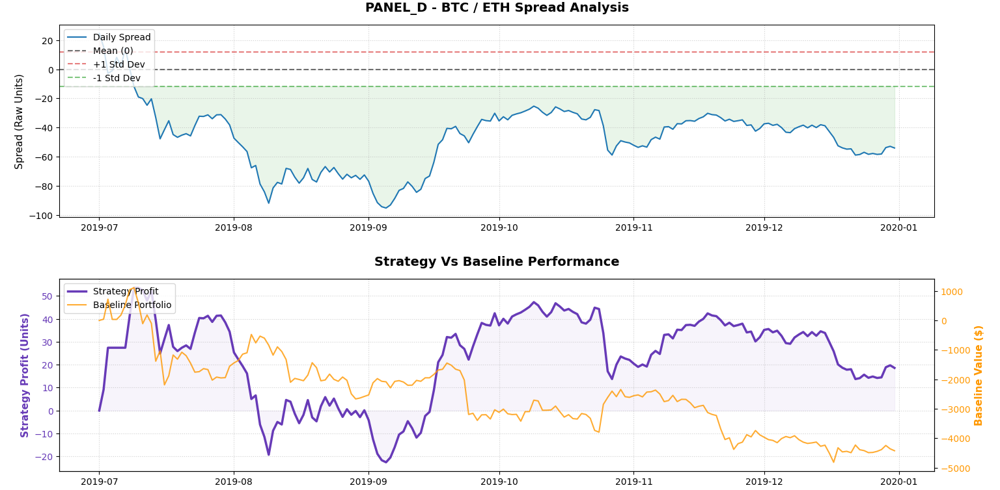

# Paper Implementation: Pairs Trading in Cryptocurrency Market

This repository implements a statistical arbitrage pipeline for cryptocurrency pairs trading based on the paper *[“Pairs Trading in Cryptocurrency Market: A Long-Short Story”]((https://businessperspectives.org/index.php/journals/investment-management-and-financial-innovations/issue-387/pairs-trading-in-cryptocurrency-market-a-long-short-story))* published in *Investment Management and Financial Innovations*.

The project explores whether cointegration-based pairs trading can identify mean-reverting relationships between crypto assets and generate market-neutral trading opportunities.

Rather than predicting the overall market direction, the strategy focuses on trading the relative price relationship between two statistically related assets.


# Project Objective

The main goal of this project is to:

- identify cointegrated cryptocurrency pairs,
- construct stationary spreads,
- simulate long-short mean-reversion trades,
- and evaluate the behavior of the strategy across different market conditions.

This project is intended as a research and educational implementation of the paper's methodology rather than a live trading system.


# Data and Testing Panels

The strategy uses daily closing prices of four cryptocurrencies:

- BTC
- ETH
- LTC
- NEO

To reduce look-ahead bias and account for changing market conditions, the historical data is divided into separate six-month panels.

| Panel | Period |
|---|---|
| **Panel A** | January 1, 2018 – June 30, 2018 |
| **Panel B** | July 1, 2018 – December 31, 2018 |
| **Panel C** | January 1, 2019 – June 30, 2019 |
| **Panel D** | July 1, 2019 – December 31, 2019 |

For each simulation cycle:

- one six-month panel is used as the **formation period**,
- and the following six-month panel is used as the **trading period**.

The formation period is used to:

- estimate hedge ratios,
- construct spreads,
- and test for cointegration.

Those parameters are then frozen and applied to the unseen trading period for out-of-sample evaluation.


# Mathematical Framework

The strategy relies on two main statistical methods:

- Ordinary Least Squares (OLS) regression
- Augmented Dickey-Fuller (ADF) stationarity testing


## 1. OLS Regression

To normalize the relationship between two assets with different price scales, the system estimates a hedge ratio using OLS regression.

The higher-priced asset is treated as the independent variable $x$, while the lower-priced asset becomes the dependent variable $y$:

$$
y_t = \beta x_t + \epsilon_t
$$

The estimated $\beta$ value acts as the hedge ratio between the two assets.

The spread is then calculated as:

$$
\text{Spread}_t = y_t - (\beta \times x_t)
$$

This spread represents the relative mispricing between the two assets after partially removing overall market direction.


## 2. ADF Stationarity Test

A spread is only tradable if it is statistically stationary (mean-reverting).

To test this, the residual spread for every asset pair is passed through the Augmented Dickey-Fuller (ADF) test.

Only pairs with $p < 0.05$ are considered cointegrated and eligible for trading. Pairs that fail the stationarity test are discarded.


# Trading Logic

For each validated pair, the standard deviation of the spread from the formation period is used as the trading threshold during the trading window.

## Entry Rules

### Short Spread Position

Triggered when:

$$
\text{Spread}_t > +\sigma
$$

strategy:

- shorts the relatively overpriced asset,
- and longs the relatively underpriced asset.


### Long Spread Position

Triggered when:

$$
\text{Spread}_t < -\sigma
$$

strategy:

- longs the relatively underpriced asset,
- and shorts the relatively overpriced asset.


## Exit Rule

All positions are closed once the spread crosses back toward its historical mean:

$$
\text{Spread}_t = 0
$$

The strategy assumes that temporary deviations from equilibrium may revert over time.


# System Architecture

The codebase is modular and follows a forward-walk backtesting structure.

## `main.py`

Controls the overall backtesting workflow:

- loads formation and trading panels,
- computes statistical parameters,
- runs simulations,
- and generates final outputs.


## `data_processing.py`

Responsible for:

- downloading historical price data using `ccxt`,
- cleaning the dataset,
- and splitting the data into six-month panels.


## `statistical_tests.py`

Handles:

- asset pair generation,
- OLS regression,
- spread construction,
- ADF testing,
- and validation of cointegrated pairs.

The module outputs:

- hedge ratios,
- spread thresholds,
- and validated trading pairs.


## `strategy_simulator.py`

Simulates the out-of-sample trading process by:

- calculating spreads during the trading window,
- generating trade signals,
- tracking cumulative spread profit,
- and comparing performance against a passive benchmark portfolio.


# Simulation Results

The results show that the market-neutral strategy was generally less affected by major crypto market declines compared to a passive buy-and-hold portfolio.

During strong bullish periods, the passive benchmark often outperformed the strategy, while bearish market periods showed stronger relative stability from the statistical arbitrage approach.

## Out-of-Sample Performance Summary

| Trading Panel | Cointegrated Pair | Beta Ratio | Trade Trigger | Strategy Profit (Units) | Baseline PnL |
| :--- | :--- | :--- | :--- | :--- | :--- |
| **Panel C** | BTC / LTC | 0.0121 | ± 8.04 | 59.43 | $23,868.39 |
| **Panel D** | BTC / ETH | 0.0255 | ± 11.70 | 18.60 | -$4,425.35 |
| **Panel D** | ETH / LTC | 0.5138 | ± 11.84 | 3.37 | -$6,134.82 |
| **Panel D** | LTC / NEO | 0.0733 | ± 1.12 | 2.28 | -$5,764.48 |


# Interpretation of Strategy Profit

**Strategy Profit (Units)** metric represents the cumulative spread captured during the simulation rather than a directly dollar-denominated return.

Because the spread is defined as:

$$
\text{Spread}_t = y_t - (\beta \times x_t)
$$

one unit of spread exposure corresponds to:

- holding 1 unit of asset $y$,
- while shorting $\beta$ units of asset $x$.

For example, if the spread moves from:

$$
-5 \rightarrow 0$$

the strategy captures approximately $5$ spread units from that mean-reversion move.

The cumulative strategy profit therefore measures how much spread convergence the algorithm captured during the trading period.

The metric is intentionally kept in spread units instead of dollars so the statistical behavior of the strategy can be evaluated independently from:

- capital allocation,
- leverage,
- compounding,
- position sizing,
- or reinvestment assumptions.

In contrast, the **Baseline PnL** metric tracks the dollar performance of a hypothetical \$10,000 equal-weight buy-and-hold portfolio over the same period.


# Visualization

The pipeline automatically generates charts showing:

- spread behavior,
- trading thresholds,
- and cumulative strategy performance.



## Chart Interpretation

### Spread Analysis (Top)

Displays the residual spread constructed using the hedge ratio estimated during the formation period.

The shaded area represents the historical spread threshold region derived from the formation period. Movements outside these boundaries indicate periods where the spread deviated significantly from its historical equilibrium and could generate trading signals.


### Strategy Vs Baseline Performance (Bottom)

Compares:

- cumulative strategy spread profit,
- against the dollar performance of a passive \$10,000 benchmark portfolio.

The results suggest that the statistical arbitrage strategy was less sensitive to the broader market decline during the trading window compared to the passive benchmark portfolio.


# Assumptions and Limitations

This project simplifies several aspects of real-world trading.

The backtest does **not** include:

- transaction costs,
- slippage,
- funding rates,
- exchange latency,
- leverage constraints,
- or portfolio-level risk management.

Additional limitations include:

- static hedge ratios during trading windows,
- daily closing prices only,
- and the assumption that cointegration relationships remain stable during the trading period.

As a result, the results should be interpreted as a research-oriented evaluation of the strategy rather than evidence of live trading profitability.


# Future Improvements

Possible future extensions include:

- rolling hedge ratio estimation,
- adaptive z-score normalization,
- transaction cost modeling,
- larger crypto asset universe,
- dynamic spread estimation,
- and portfolio-level capital allocation.


# Local Installation and Execution

This project uses `uv` for dependency management.

## 1. Clone the Repository

```bash
git clone https://github.com/drjollof/crypto-pairs-trading.git
cd crypto-pairs-trading
```

## 2. Install Dependencies

```bash
uv init
uv add pandas statsmodels matplotlib ccxt
```

## 3. Run the Pipeline

```bash
uv run main.py
```

The pipeline will:

- run the statistical tests,
- identify cointegrated pairs,
- execute the backtest,
- generate charts,
- and print the final performance summary.


# Disclaimer

This repository is intended for educational and research purposes only.

It does not constitute financial advice or investment recommendation.